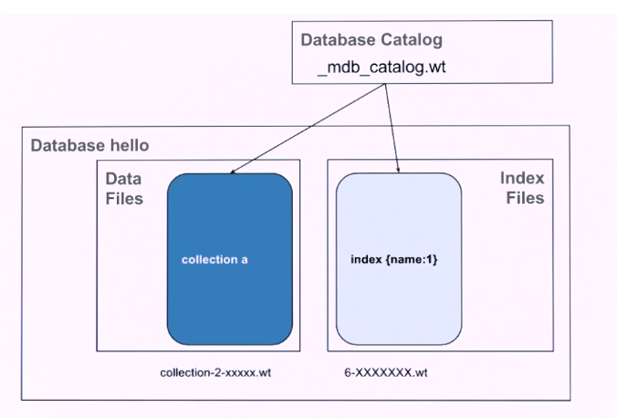
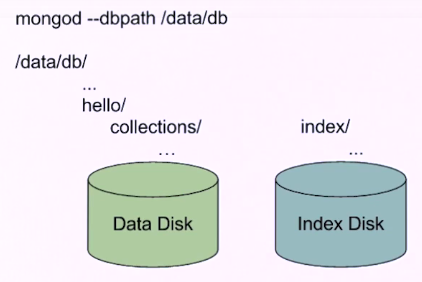
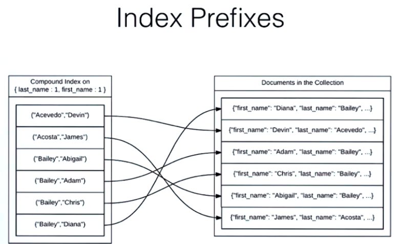

https://university.mongodb.com/mercury/M201

## Chapter_2

* Indexes
* MongoDb use B-tree

### Index Overhead
[Indexes](https://docs.mongodb.com/manual/indexes/?jmp=university)

### Data is Storad in Disk

* Use the different disks possibilite increase the performance





* [storage.directoryPerDB](https://docs.mongodb.com/manual/reference/configuration-options/#storage.directoryPerDB)
* [directoryForIndexes](https://docs.mongodb.com/manual/reference/configuration-options/#storage.wiredTiger.engineConfig.directoryForIndexes)

### Single Field Indexes

* Simplest indexes in MongoDB
* db.<collection>.createIndex({<field>:<direction>})
* Key Features
    - Keys from only one field
    - Can find a single value for the indexed field
    - Can find a range of values
    - Can use dot notation to index fields in subdocuments
    - Can be used to find several distinct values in a single query

* If field not exists in document, when created index this field is registred with value null.

* Not recommended create index on subdocument without dot notation.

### Querying on Compound Indexes Part 1

```
wget https://s3.amazonaws.com/m312/people.json

mongoimport --host Sandbox-shard-0/sandbox-shard-00-00-felrd.mongodb.net:27017,sandbox-shard-00-01-felrd.mongodb.net:27017,sandbox-shard-00-02-felrd.mongodb.net:27017 \
            --ssl --username m001-student \
            --password <PASSWORD> \
            --authenticationDatabase admin \
            --db m201 \
            --collection people \
            --type json \
            --file people.json
```

```
{"last_name": "Frazier","first_name":"Jasmine"}
{"last_name": "Frazier","first_name":{$gte : "L"}}
```

### Prefix Index

[Index Compound](https://docs.mongodb.com/manual/core/index-compound/?jmp=university)
[create-indexes-to-support-queries](https://docs.mongodb.com/manual/tutorial/create-indexes-to-support-queries/?jmp=university)

```js
{"last_name": "Solomon"}
{"first_name": "Sonia"}
```



* For a query on mutiple fields that overlap with the index, idenify wich fields in the query can use the index.

### When you can sort with Indexes

[Sort results with indexes](https://docs.mongodb.com/manual/tutorial/sort-results-with-indexes/?jmp=university)


### Multikey Indexes

[Multikey Indexes](https://docs.mongodb.com/manual/core/index-multikey/?jmp=university)


### Partial Indexes

[Partial Indexes](https://docs.mongodb.com/manual/core/index-partial/?jmp=university)

* You cannot specify both the partialFilterExpression and the sparse options
* _id indexes cannot be partial indexes
* Shared Key indexes cannot be partial indexes

### Text Indexes

* More keys to examine
* Increased index size
* Increased time to build index
* Decreased write performance

```js
db.<collection>.createIndex({ <field> : "text" })db.<collection>.createIndex({ <field>: 1 ,<field>: "text" })
```

[Text Search](https://docs.mongodb.com/manual/text-search/)

```js
MongoDB Enterprise Sandbox-shard-0:PRIMARY> use m201
switched to db m201
MongoDB Enterprise Sandbox-shard-0:PRIMARY> db.textExample.insertOne({ "statement": "MongoDB is the best" })
{
	"acknowledged" : true,
	"insertedId" : ObjectId("5ce99630ef9ce7e04c2d441c")
}
MongoDB Enterprise Sandbox-shard-0:PRIMARY> db.textExample.insertOne({ "statement": "MongoDB is the worst." })
{
	"acknowledged" : true,
	"insertedId" : ObjectId("5ce99634ef9ce7e04c2d441d")
}
MongoDB Enterprise Sandbox-shard-0:PRIMARY> db.textExample.createIndex({ statement: "text" })
{
	"createdCollectionAutomatically" : false,
	"numIndexesBefore" : 1,
	"numIndexesAfter" : 2,
	"ok" : 1,
	"operationTime" : Timestamp(1558812218, 3),
	"$clusterTime" : {
		"clusterTime" : Timestamp(1558812218, 3),
		"signature" : {
			"hash" : BinData(0,"xQ5kUYmgfLYq2WEiDSvi3rdlvY4="),
			"keyId" : NumberLong("6663162076321546241")
		}
	}
}
MongoDB Enterprise Sandbox-shard-0:PRIMARY> db.textExample.find({ $text: { $search: "MongoDB best" } })
{ "_id" : ObjectId("5ce99630ef9ce7e04c2d441c"), "statement" : "MongoDB is the best" }
{ "_id" : ObjectId("5ce99634ef9ce7e04c2d441d"), "statement" : "MongoDB is the worst." }
MongoDB Enterprise Sandbox-shard-0:PRIMARY> db.textExample.find({ $text: { $search : "MongoDB best" } }, { score: { $meta: "textScore" } })
{ "_id" : ObjectId("5ce99634ef9ce7e04c2d441d"), "statement" : "MongoDB is the worst.", "score" : 0.75 }
{ "_id" : ObjectId("5ce99630ef9ce7e04c2d441c"), "statement" : "MongoDB is the best", "score" : 1.5 }
MongoDB Enterprise Sandbox-shard-0:PRIMARY> db.textExample.find({ $text: { $search : "MongoDB best" } }, { score: { $meta: "textScore" } }).sort({ score: { $meta: "textScore" } })
{ "_id" : ObjectId("5ce99630ef9ce7e04c2d441c"), "statement" : "MongoDB is the best", "score" : 1.5 }
{ "_id" : ObjectId("5ce99634ef9ce7e04c2d441d"), "statement" : "MongoDB is the worst.", "score" : 0.75 }
```

### Collations

[Collations](https://docs.mongodb.com/manual/reference/collation/?jmp=university)
