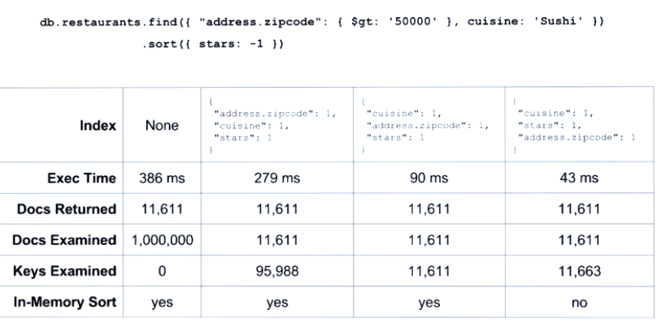

https://university.mongodb.com/mercury/M201

# Chapter_4 CRUD Optimization

* Index Selectivity
* Equality, Sort, Range

    - equality: indexed fields on which our queries will do equality matching
    - sort: indexed fields on which our queries will sort on
    - range: indexed fields on which our queries will have a range condition

* Performance Tradeoffs

[create-indexes-to-support-queries](https://docs.mongodb.com/manual/tutorial/create-indexes-to-support-queries/?jmp=university)
[sort-results-with-indexes](https://docs.mongodb.com/manual/tutorial/sort-results-with-indexes/?jmp=university)
[create-queries-that-ensure-selectivity](https://docs.mongodb.com/manual/tutorial/create-queries-that-ensure-selectivity/?jmp=university)

## Covered Queries

* Very performant
* Satisfied entirely by index keys (fields in index in return the query)
* 0 documents need to be examined

[query-optimization](https://docs.mongodb.com/manual/core/query-optimization/?jmp=university)

### You can't cover a query if...

* Any of the indexed fields are arrays
* Any of the indexed fiels are embedded documents
* When run aginst a mongos if the index does not contain the shared key