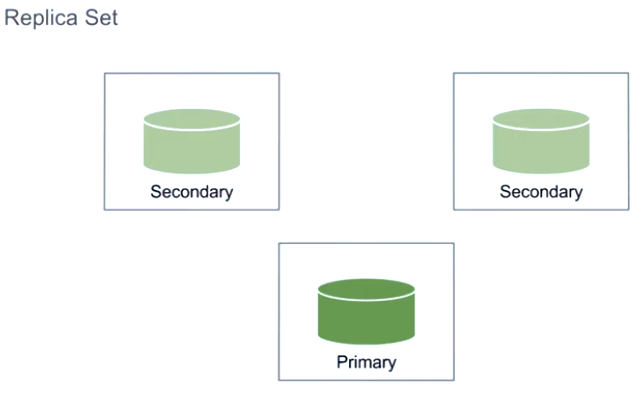
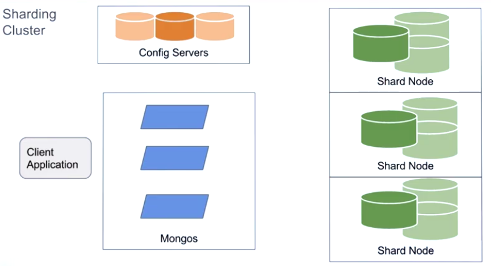
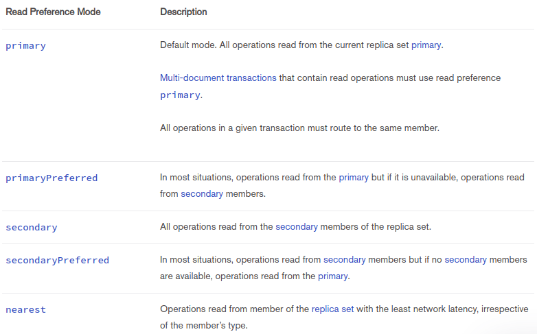
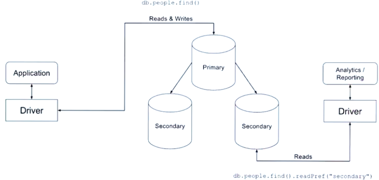
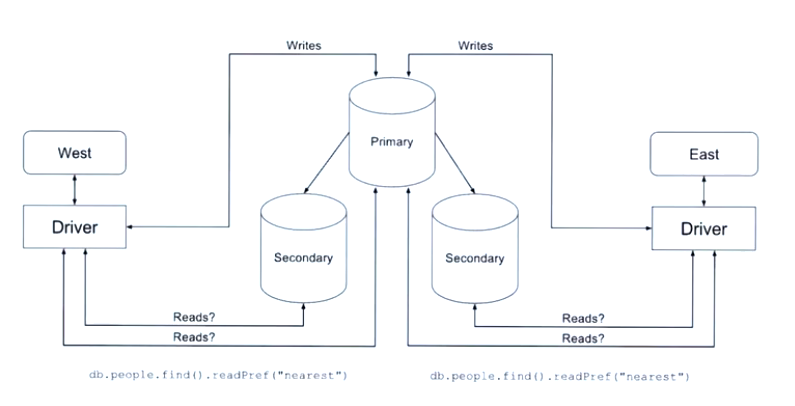
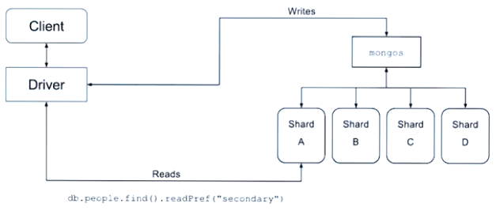

https://university.mongodb.com/mercury/M201

# Chapter 5: Performance on Clusters

* Replica Cluster
    - high availability
* Shard Cluster
    - horizontal scalable data




## Considerations before sharding

* Sharding is an horizontal scaling solution
* Have we reached the limits of our vertical scaling?
* You need to understand how you data grows and how your data is accessed
* Sharding works by defining key based ranges - our shard key
* It's important to get a good shard key

[distributed-queries](https://docs.mongodb.com/manual/core/distributed-queries/?jmp=university)

## Increasing Write Performance with Sharding

* Vertical vs Horizontal scaling

* Shard key Factors
    - Frequency (Frequency of the value the key data is inserted - cardinality)
    - Cardinality
    - Rate of change

### Bulk Writes

```js
db.collection.bulkWrite(
   [ <operation 1>, <operation 2>, ... ],
   {
      writeConcern : <document>,
      ordered : <boolean>
   }
)
```

* In the default ordered : true state, each operation will be executed in order.

* If ordered is set to false, operations may be reordered by mongod to increase performance. Applications should not depend on order of operation execution.

[bulk-write-operations](https://docs.mongodb.com/manual/core/bulk-write-operations/)
[db.collection.bulkWrite](https://docs.mongodb.com/manual/reference/method/db.collection.bulkWrite/)

[distributed-write-operations](https://docs.mongodb.com/manual/core/distributed-write-operations/?jmp=university)

## Reading from Secondaries

```js
db.collection.find().readPref("primary") // is default
```



### When Reading from a Secondary is a *Good* Idea

* Offloading work



* Local reads



### When Reading from a Secondary is a *Bad* Idea

* In general
* Providing extra capacity for reads
* Reading from shards



[read-preference](https://docs.mongodb.com/manual/core/read-preference/?jmp=university)

## Replica Sets with Differing Indexes

Use cases example:

* Specific analytics secondary nodes
* Reporting on delayed consistency data
* Text Search

Secondary Node Considerations

* Prevent such a secondary from becoming primary
    - Priority = 0
    - Hidden Node
    - Delayed Secondary

### Pratice:

```sh
docker run --rm -it -v $PWD:/replica mongo bash
mkdir -p /data/r{0,1,2}
cd /replica/replicaset_configs/
mongod -f r0.cfg
mongod -f r1.cfg
mongod -f r2.cfg

mongo --port 27000
var conf = {
    "_id" : "M201",
    "members" : [
        {"_id": 0, "host": "127.0.0.1:27000"},
        {"_id": 1, "host": "127.0.0.1:27001"},
        {"_id": 2, "host": "127.0.0.1:27002", "priority":0}
    ]
};

rs.initiate(conf)
rs.isMaster()
```

[adjust-replica-set-member-priority](https://docs.mongodb.com/manual/tutorial/adjust-replica-set-member-priority/)

```js
cfg = rs.conf()

cfg.members[0].priority = 0.5
cfg.members[1].priority = 2
cfg.members[2].priority = 2

rs.reconfig(cfg)
```

## Aggregation Pipeline on a Sharded Cluster

Operations the shard primary execute de merge data:
* $out
* $facet
* $lookup
* $graphLookup

[aggregation-pipeline-sharded-collections](https://docs.mongodb.com/manual/core/aggregation-pipeline-sharded-collections/?jmp=university)