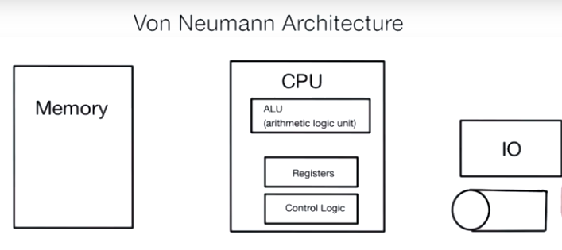
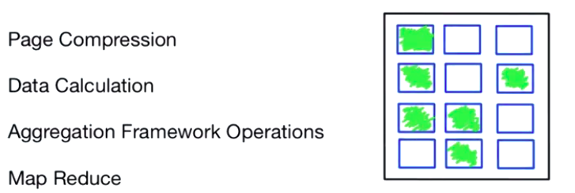
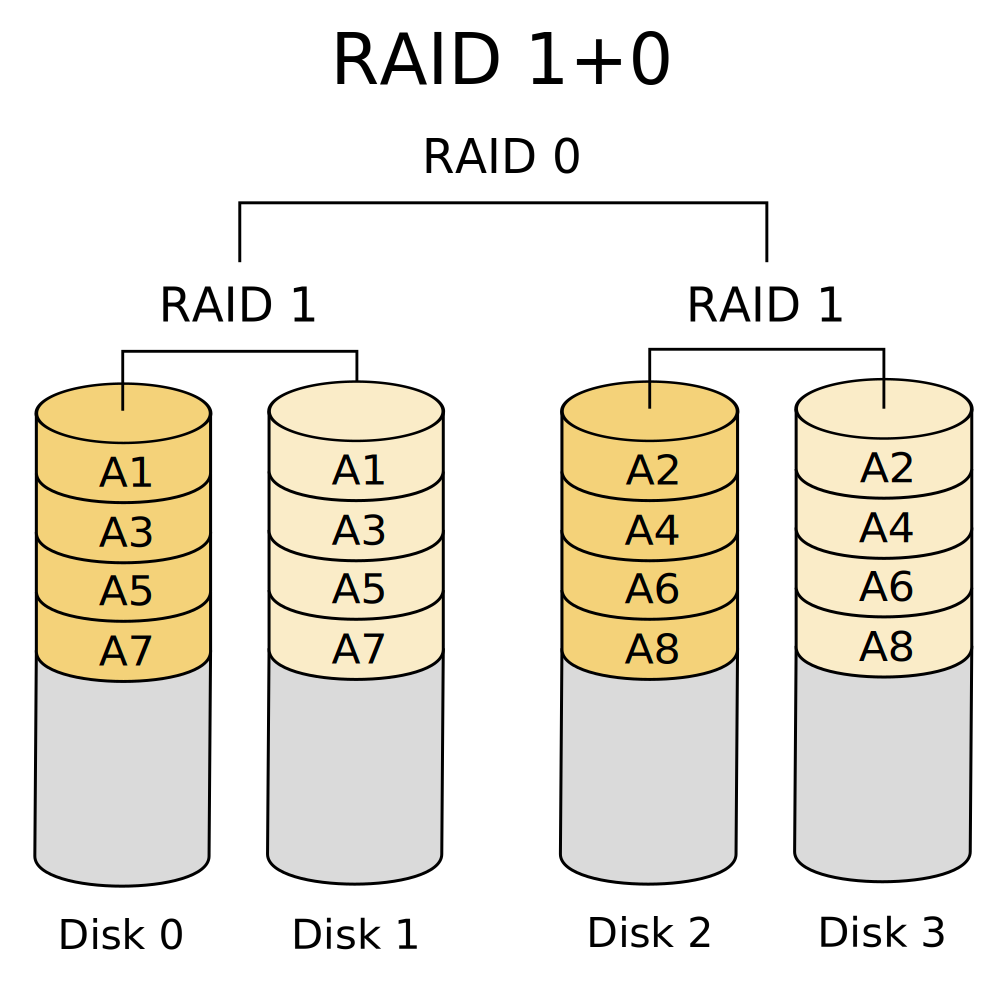
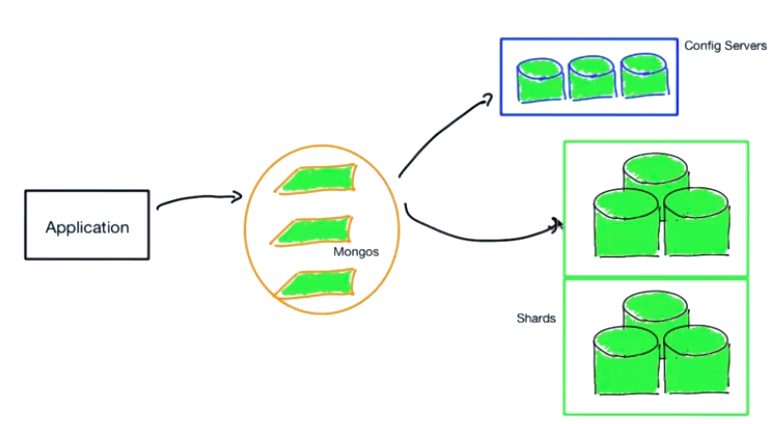

https://university.mongodb.com/mercury/M201

## Chapter_1

* Overview
* Indexes
* Index Operations
* CRUD Optimization
* Distributed Systems

### Hardware Considerations



Operations in memory
- Aggregation
- Index Traversing
- Write Operations (in memory)
- Query Engine
- Connection




### Architeture Storage Recomendation





### Exercise:

- Lab 1.1: Install Course Dependencies
"Welcome to your first lab in M201! In this lab you're going to install MongoDB Enterprise 3.4 and import the people dataset."

```
mkdir Chapter_1
cd Chapter_1
wget https://s3.amazonaws.com/edu-downloads.10gen.com/M201_2019_May/static/handouts/m201/people.json

docker container stop mongodb
docker container rm mongodb
docker run -v $PWD:/json --name mongodb -d mongo:4.0
docker exec -it mongodb mongoimport --db people --collection people --file /json/people.json
docker exec -it mongodb mongo people --eval 'db.people.count({ "email" : {"$exists": 1} })'
```