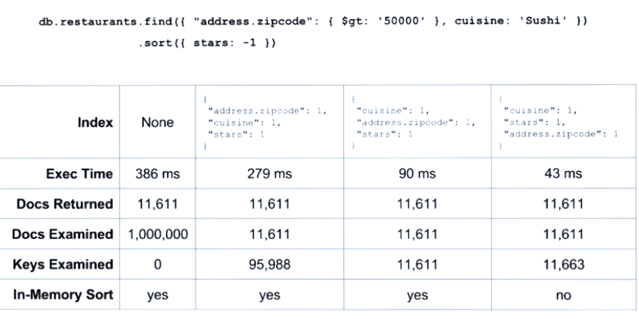
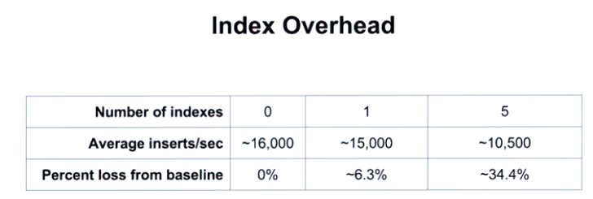
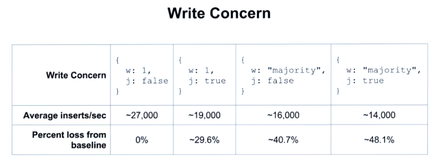
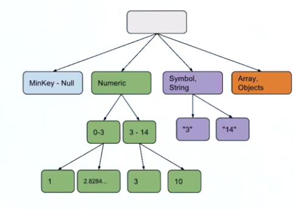

https://university.mongodb.com/mercury/M201

# Chapter_4 CRUD Optimization

* Index Selectivity
* Equality, Sort, Range



    - equality: indexed fields on which our queries will do equality matching
    - sort: indexed fields on which our queries will sort on
    - range: indexed fields on which our queries will have a range condition

* Performance Tradeoffs

[create-indexes-to-support-queries](https://docs.mongodb.com/manual/tutorial/create-indexes-to-support-queries/?jmp=university)
[sort-results-with-indexes](https://docs.mongodb.com/manual/tutorial/sort-results-with-indexes/?jmp=university)
[create-queries-that-ensure-selectivity](https://docs.mongodb.com/manual/tutorial/create-queries-that-ensure-selectivity/?jmp=university)

## Covered Queries

* Very performant
* Satisfied entirely by index keys (fields in index in return the query)
* 0 documents need to be examined

[query-optimization](https://docs.mongodb.com/manual/core/query-optimization/?jmp=university)

### You can't cover a query if...

* Any of the indexed fields are arrays
* Any of the indexed fiels are embedded documents
* When run aginst a mongos if the index does not contain the shared key

## Regex Performance

* Utilizing indexes on regex conditions

```js
// Use query find name with initial kirby exactly.
db.users.find({username: /^kirby/})
```

## Insert Performance

* Index Overhead
* WriteConcern

### Write Concern Specification

```js
{ w: <value>, j: <boolean>, wtimeout: <number> }
```

* the *w* option to request acknowledgment that the write operation has propagated to a specified number of mongod instances or to mongod instances with specified tags.
* the *j* option to request acknowledgment that the write operation has been written to the on-disk journal, and
* the *wtimeout* option to specify a time limit to prevent write operations from blocking indefinitely.




[write-concern-specification](https://docs.mongodb.com/manual/reference/write-concern/#write-concern-specification)
[read-concern-write-concern-read-preference](https://docs.mongodb.com/manual/core/transactions/#read-concern-write-concern-read-preference)
[write-performance](https://docs.mongodb.com/manual/core/write-performance/?jmp=university)
[POCDriver](https://github.com/johnlpage/POCDriver)

## Data Type Implications

* Flexible schema tradeoffs
* Data consistency implications
* Query correctness

* Avoid data consistency issues
* Correctness
* Ordering and Sorting results
* Simplification of your code base
* Use [document validation](https://docs.mongodb.com/manual/core/schema-validation/)

### Order sorting data types from BSON documents

1. MinKey (internal type)
2. Null
3. Numbers (ints, longs, doubles, decimals)
4. Symbol, String
5. Object
6. Array
7. BinData
8. ObjectId
9. Boolean
10. Date
11. Timestamp
12. Regular Expression
13. MaxKey (internal type)

[bson-type-comparison-order](https://docs.mongodb.com/manual/reference/bson-type-comparison-order/)

### Index Structure



* Sort find wiht numeric order:

```js
db.collection.find({},{field:1, _id:0}).collation({locale:'en', numericOrdering:true}).sort({field:1})
```

### Application Implications

* Client side logic to deal with different datatypes
* More complex code base
* More complex test base

## Aggregation Performance

* Index usage
    - When the stage not use index all the next stages not use index
* Memory Constraints
    - Results are subject to 16MB document limit
        - Use `$limit` and `$project`
    - 100MB of RAM per stage
        - Use indexes
        - db.orders.aggregate([...],*{allowDiskUse:true}*)
            - *Doesn't work with* $graphLookup

[aggregation-pipeline-optimization](https://docs.mongodb.com/manual/core/aggregation-pipeline-optimization/)
[mongodb: will limit() increase query speed?](https://stackoverflow.com/questions/31162746/mongodb-will-limit-increase-query-speed/31163192#31163192)

### Types query aggregation

* "Realtime" Processing
    - Provide data for *applications*
    - Query performance is *more important*
* Batch Processing
    - Provide data for *analytics*
    - Query performance is *less important*

## Lab 4.1: Equality, Sort, Range

```js
db.accounts.find( { accountBalance : { $gte : NumberDecimal(100000.00) }, city: "New York" } )
           .sort( { lastName: 1, firstName: 1 } )
//Index
{ city: 1, lastName: 1, firstName: 1, accountBalance: 1 }
```

## Lab 4.2: Aggregation Performance

```js
mongoimport -d m201 -c restaurants --drop restaurants.json

db.restaurants.aggregate([
  { $match: { stars: { $gt: 2 } } },
  { $sort: { stars: 1 } },
  { $group: { _id: "$cuisine", count: { $sum: 1 } } }
])

db.restaurants.aggregate([
  { $match: { stars: { $gt: 2 } } },
  { $sort: { stars: 1 } },
  { $group: { _id: "$cuisine", count: { $sum: 1 } } }
],{explain:true})

db.restaurants.createIndex({ stars: 1 })
```